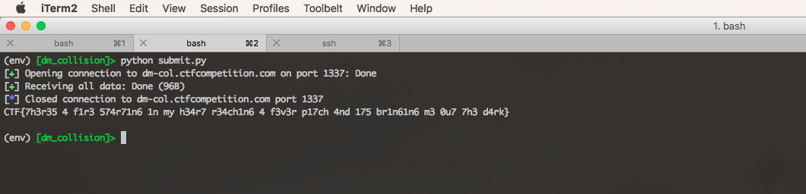

# Google CTF 2018: DM Collision (176 pts, 63 solves)

* Server: dm-col.ctfcompetition.com:31337
* Challenge files:
  * [challenge.py](challenge.py)
  * [not-des.py](not-des.py)

## Writeup

TL;DR: do horrible things to a one-way compression function by leveraging weak keys in the DES block cipher.

Read my writeup [here](https://fortenf.org/e/ctfs/crypto/2018/06/27/google-ctf-2018-dm-collision.html).

## Files

* [challenge.py](challenge.py) - the service
* [not-des.py](not-des.py) - python implementation of DES, with permuted S-boxes
* [des.c](des.c) - C implementation of DES, with permuted S-boxes, that searches for a fixed point
* [verify_fixed_point.py](verify_fixed_point.py) - verifies found fixed point
* [submit.py](submit.py) - pwntools script to submit exploit
